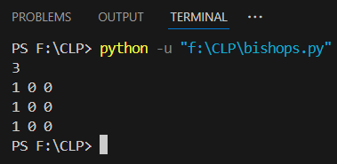
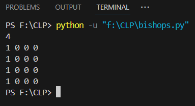

Place exactly N bishops on an N×N chessboard such that no two bishops attack each other diagonally. Print one valid board configuration using 1s and 0s.

Case#1Input:
3

Case#1Output:
1 0 0  
0 0 1  
1 0 0

Case#2Input:
4

Case#2Output:
1 0 0 0  
0 0 1 0  
1 0 0 0  
0 0 0 1

For Case 1,

For Case 2,

